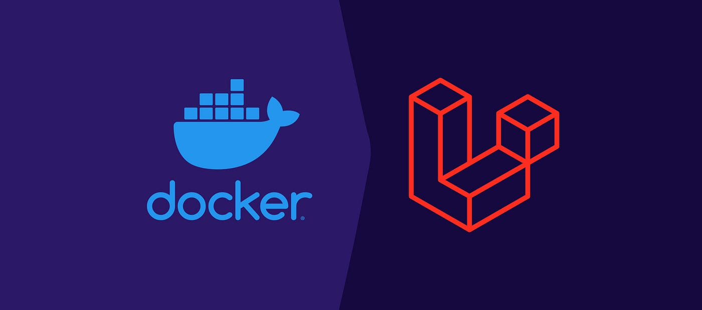

## Setting up Laravel with docker and sail on Windows 11

  

## Prerequisites

- [**WSL (Windows Subsystem for Linux)**](https://learn.microsoft.com/en-us/windows/wsl/install-manual)
- [**Docker Desktop**](https://desktop.docker.com/win/main/amd64/Docker%20Desktop%20Installer.exe)
- [**Laravel Sail**](https://laravel.com/docs/10.x/sail)

# Installing WSL

Follow these 6 steps to install WSL:
### Step 1 - Enable WSL
<code style="padding: 20px; background-color: #f4f4f4;">dism.exe /online /enable-feature /featurename:Microsoft-Windows-Subsystem-Linux /all /norestart</code>

### Step 2 - Check requirements for running WSL 2

(Ensure you meet the version and build number criteria)
Update to the latest Windows version in the Settings menu if needed.

### Step 3 - Enable Virtual Machine feature
<code style="padding: 20px; background-color: #f4f4f4;">dism.exe /online /enable-feature /featurename:VirtualMachinePlatform /all /norestart</code>

### Step 4 - Download the Linux kernel update package

(Choose the appropriate package based on your system type)
Install the package and proceed to the next step.

### Step 5 - Set WSL 2 as the default version
<code style="padding: 20px; background-color: #f4f4f4;">wsl --set-default-version 2</code>

### Step 6 - Install Linux Distribution

Visit the [**Microsoft Store**](https://aka.ms/wslstore) and select your preferred Linux distribution (e.g., **Ubuntu**). Launch the newly installed distribution, create a user account, and password.

# Install Windows Terminal (Optional)

Install [**Windows Terminal**](https://learn.microsoft.com/en-us/windows/terminal/get-started) for enhanced command line functionality.

# Installing Docker Desktop

Download and run [**Docker Desktop Installer**](https://desktop.docker.com/win/main/amd64/Docker%20Desktop%20Installer.exe).

Follow the installation prompts, ensuring to select the appropriate backend option. Start Docker Desktop after successful installation.

# Install Laravel Project
### Create a new Laravel project
<code style="padding: 20px; background-color: #f4f4f4;">curl -s https://laravel.build/example-app | bash</code>

### Navigate to the project directory and start Laravel Sail
<code style="padding: 20px; background-color: #f4f4f4;">cd example-app
./vendor/bin/sail up</code>

### Optionally, create a shell alias for Sail commands.
### Add to your shell configuration file (e.g., ~/.zshrc or ~/.bashrc)
<code style="padding: 20px; background-color: #f4f4f4;">alias sail='[ -f sail ] && sh sail || sh vendor/bin/sail'</code>

### Restart your shell.

## Starting & Stopping Sail

### Start Laravel Sail
<code style="padding: 20px; background-color: #f4f4f4;">sail up</code>

### Start in detached mode
<code style="padding: 20px; background-color: #f4f4f4;">sail up -d</code>

### Access the project in your browser at http://localhost

### Stop all containers
<code style="padding: 20px; background-color: #f4f4f4;">sail stop</code>

# Important Notes

- To change the database service, edit the `docker-compose.yml` file.
- Install **PhpMyAdmin** for MySQL or **PgAdmin 4** for pgsql for graphical database interaction.

# Troubleshooting Notes
If you encounter a RuntimeException like:

 > In order to use the Auth::routes() method, please install the laravel/ui package.

To resolve this issue, you'll need to install the laravel/ui package. This package provides a simple way to scaffold authentication views and routes.

You can install it using Composer with the following command:
<code style="padding: 20px; background-color: #f4f4f4;">composer require laravel/ui</code>

If you receive a message like:

> Do not run Composer as root/super user! See [https://getcomposer.org/root](https://getcomposer.org/root) for details

Instead, it's best to run Composer as a regular user. If you need to install global packages, you can use the --global flag, but still without sudo.

Here's the proper way to install the laravel/ui package without using sudo:
<code style="padding: 20px; background-color: #f4f4f4;">composer require laravel/ui --dev</code>

The --dev flag is optional and is used if you only need this package for development purposes. If you need it in production, you can omit this flag.

After installing the package, you can generate the necessary views and routes for authentication using Artisan:
<code style="padding: 20px; background-color: #f4f4f4;">php artisan ui bootstrap --auth</code>

Replace bootstrap with the front-end framework you're using (e.g., vue, react, etc.) if it's different.

This will generate the authentication views in your resources/views/auth directory, along with the necessary routes.

## Remember to clear your config cache if you've previously cached it:
<code style="padding: 20px; background-color: #f4f4f4;">php artisan config:clear</code>

After doing this, try running your Laravel application again.

If you're using Docker and Laravel Sail, you might need to rebuild your Docker containers to make sure the changes take effect:
<code style="padding: 20px; background-color: #f4f4f4;">sail down</code>
<code style="padding: 20px; background-color: #f4f4f4;">sail up -d</code>

Make sure to backup any important files or configurations before making these changes.
